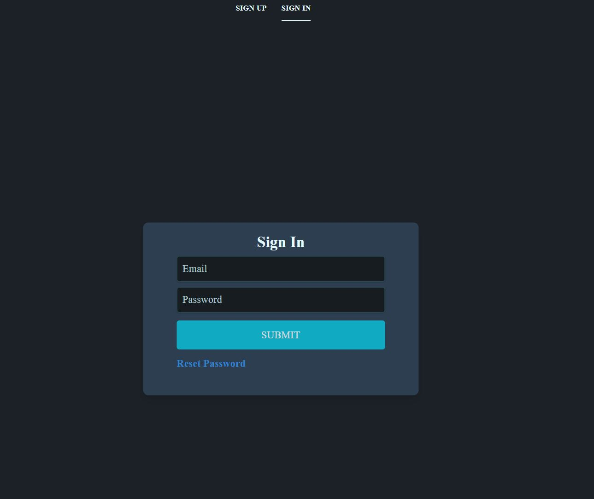
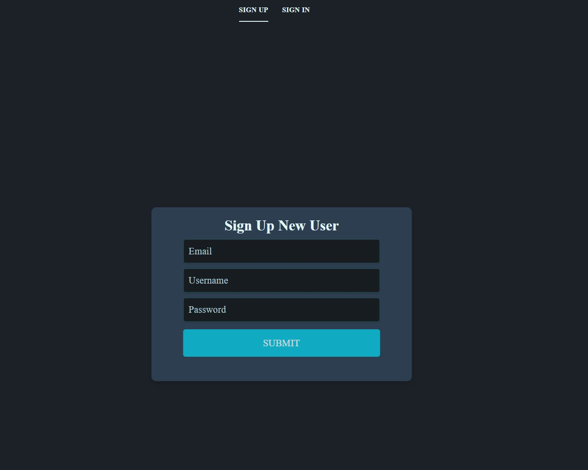
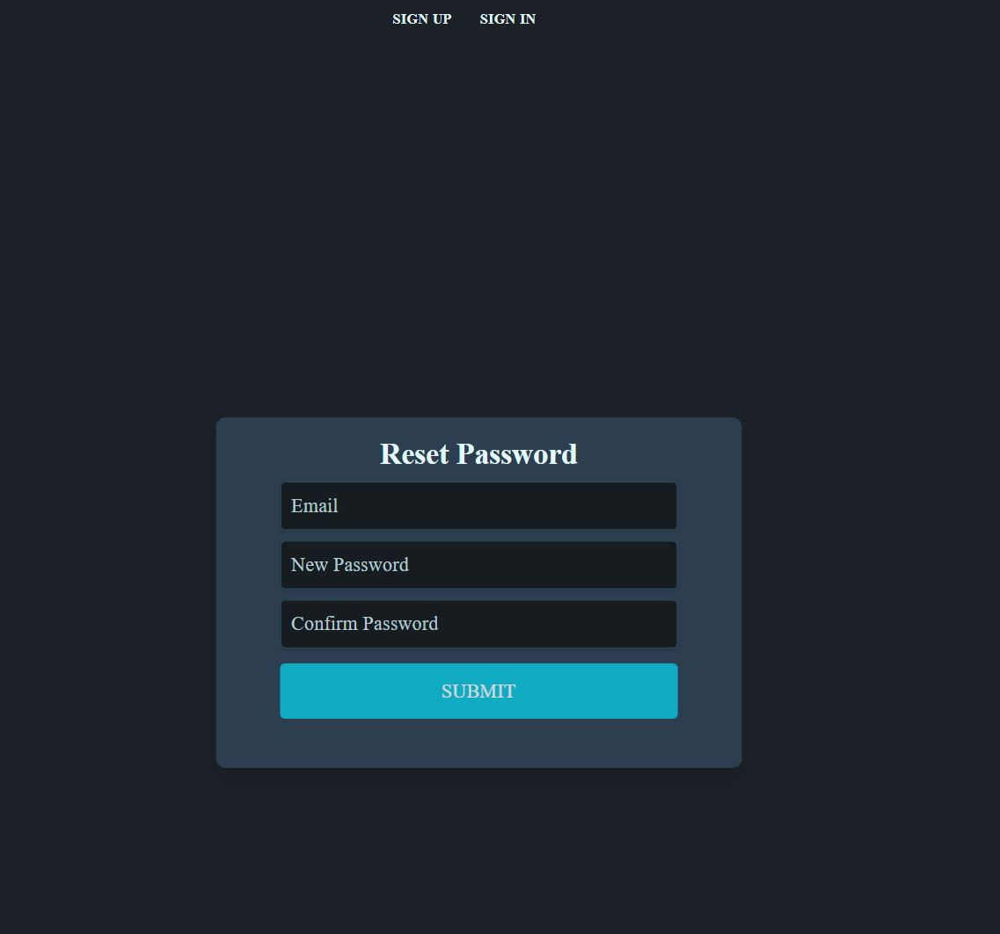
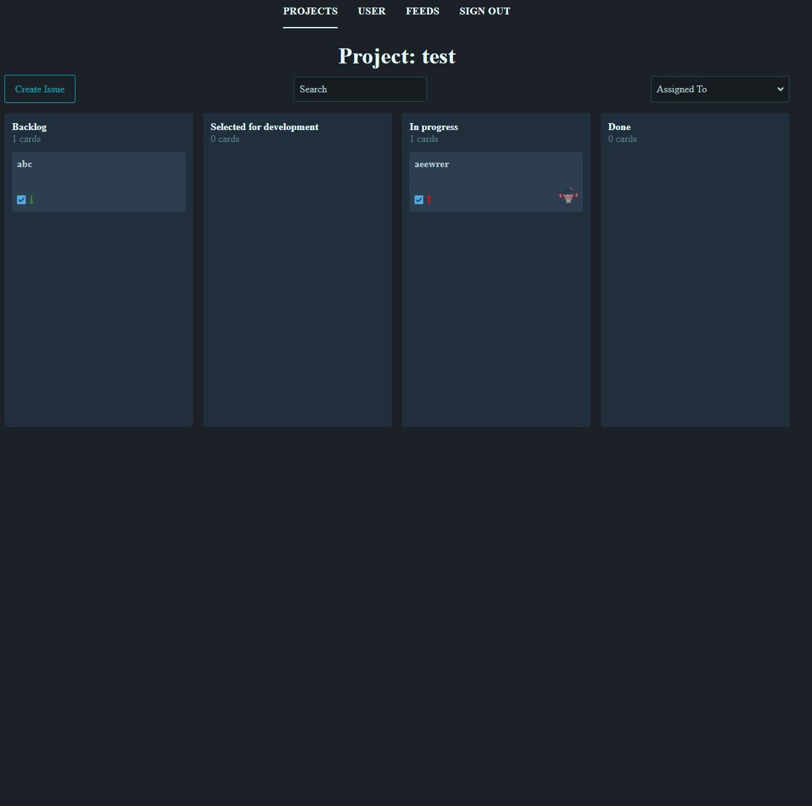
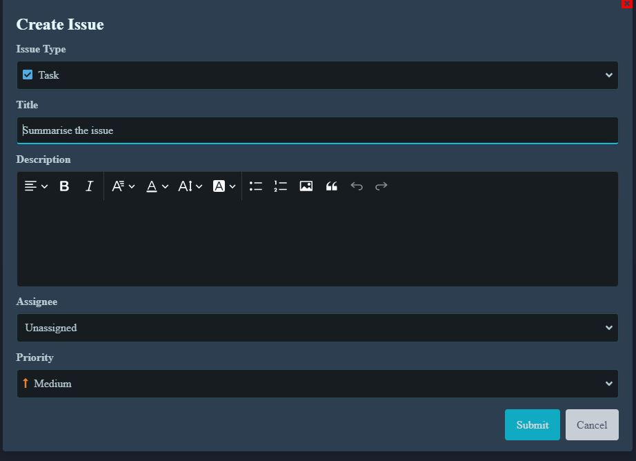

# Issue Management - FrontEnd

> This is a Jira clone front end site built with React, Apollo, Tailwind.

## Features

> CRUD (Create, Read, Update And Delete)

- Authentication with JWT
  - Login
  - Register
  - Reset Password
- Project (CRUD)
  - CRUD projects
  - Paginated query
  - Notifications
- Issue within project
  - CRUD issues
  - Tracking management
  - CRUD comments within issue
  - Drag and Drop

## Configuration File

In App folder > config.js, modify the endpoint, this is the endpoint of the backend server

```
export const devEndpoint = "http://localhost:5555/";
export const prodEndpoint = `https://jira-yoga-clone.herokuapp.com/`;
```

### Install packages

```
npm install
```

## Start

```console
npm run dev
```

## Test

Testing with Jest and enzyme (still need more tests, only covering a few tests)

## Screenshots

### Sign In (/signin)



### Sign Up (/signup)



### Reset Password Page (/reset)



### Projects Page (/projects)


### Listing Issues (/project/:projectId)



### Create Issue



### Edit Issue (/issues/:issueId)


